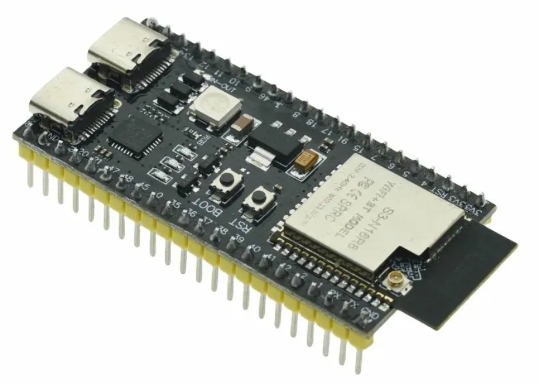
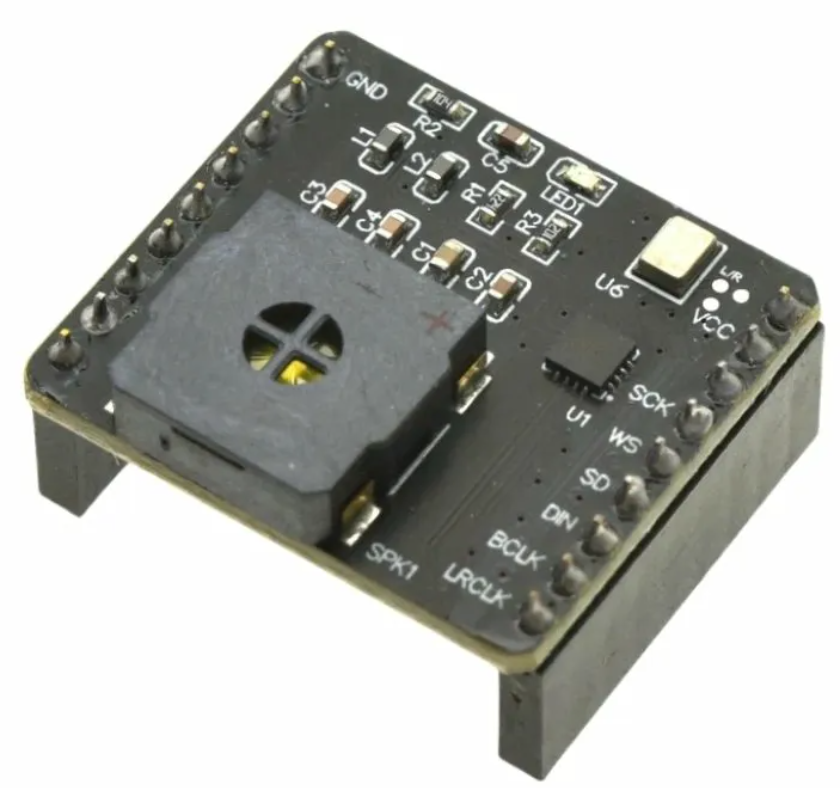

# AI-Chatbot-ESP32
This is a repo I fork from existing AI API for testing a cloud hosted chatbot featuring ESP32S3 as its base data input/output source

## Board
ESP32S3 development board 

INMP441 + MAX98357 with speaker module

## DAZI-AI
This repo is my 1st implementation, I pretty much uses followed the instruction all the way through except the chat_asr.ino need these few changes: 
- SCK -> GPIO 4
- WS -> GPIO 5
- SD -> GPIO 6
- DIN -> GPIO 7
- BCLK -> GPIO 15
- LRCLK -> GPIO 16
- Go to http://aisteb.com/ to accquire the API key, or you can generate your own API key with your own AI.

## XIAOZHI-AI
This repe is my 2nd implementaion, this repo uses vscode as base IDE, and flash the software with idf.py which is included with esp idf tools, you can get it from https://dl.espressif.com/dl/esp-idf/. Downlad the lastest offline version. My is version 5.5.4.
Back to the repo, you will want to create your own setting if you are not using what the repo readme suggested under ./main/boards/, you can create it as /my-esp32s3, and inside this you should have 2 file:
- /config.h - this should contain all the port specification of your own config GPIO port
- /my_esp32s3_board.cc - this should define the logic of conversation trigger method, audio get method, audio out method, and optional display method. 
